# How to more rapidly input a desired magnetic ordering into VASP INCAR from POSCAR file

Within VASP, the magnetic ordering is determined based on the initial magnetic moments supplied within the INCAR file from the **MAGMOM** tag. While it is fairly simple to have either a non-magnetic or ferromagnetic ordering, for anti-ferromagnetic systems with a more complex magnetic ordering this can be much more difficult and very tedious. I have figured out a way to expedite the process of defining this with the GUI from the Atomic Simulation Environment (ASE) (https://gitlab.com/ase/ase). While this is still not fully automated(I am currently working on this!), I have found that this can really help speed up generating the desired MAGMOM tag for VASP calculations.
***

## Steps
**NOTE that one needs to use the same POSCAR file here**

*It is assumed that the user has ASE installed properly and that they have X11/Wayland forwarding on their machine*

This example will be performed with the rocksalt NiO which is known to have an anti-ferromagnetic type-II (AFMII) ordering with alternative ferromagnetic planes in the 111 direction (image from Dudarev, S. L. *et al*. Electron-Energy-Loss Spectra and the Structural Stability of Nickel Oxide: An LSDA+U Study. Phys. Rev. B 1998, 57 (3), 1505–1509. https://doi.org/10.1103/PhysRevB.57.1505.):
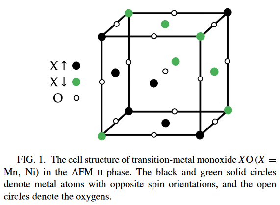 
### 01 - Opening POSCAR file with ASE GUI
Using a *nix command line, the POSCAR file can be opened using the following command:

 $ase gui POSCAR

The following window will then open:

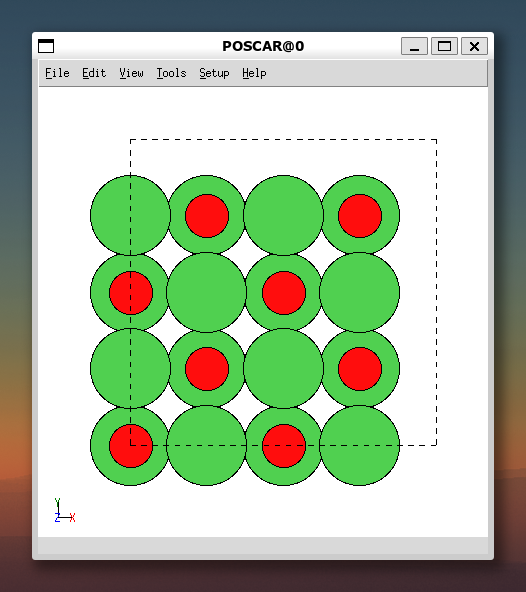

### 02 - Positioning structure such that the desired magnetic ordering can be seen
One then needs to use the ASE GUI to turn the structure the desired fashion so that the AFMII can be easy seen (NOTE that this is *much* easier with a mouse compared to a trackpad):
- I also find it easier sometimes to reduce the size of the atoms by changing the following within the ASE GUI: >View>Settings>Scale atomic radii. The default for NiO is 0.89, in the following image I have reduced this to 0.7.

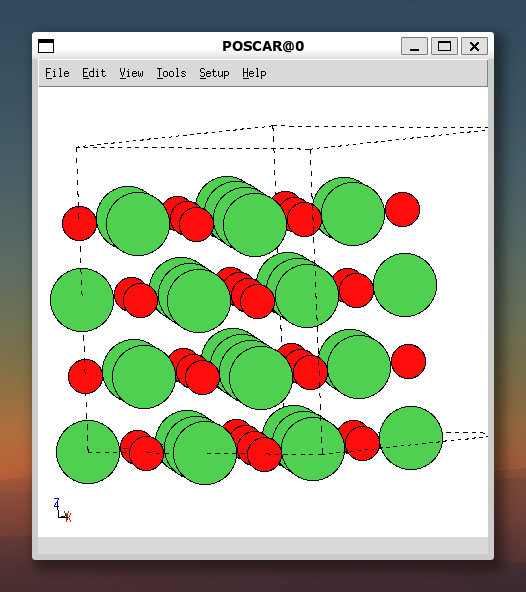

We now can see that the z-direction is upwards, and we have oriented the cell such that we can determine the AFMII magnetic ordering with the eye.

### 03 - Selecting atoms and giving them a magnetic moment
Now we will start to select all of the atoms which we will want to be initialized as spin-up. I always start this at the origin and move on from their. You can hold CTRL to select more than one atom at a time.

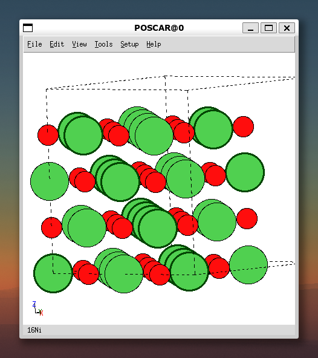

We can see that we have 16 Nickel atoms selected in the bottom left corner, and can see the AFMII magnetic ordering denoted by the highlighted atoms with a thicker border.
Now we need to give them a local magnetic moment by going to >Edit>Modify>Moment.

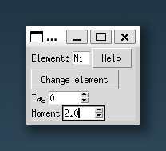

Here I have given these a local magnetic moment of 2.0 Bohr-Magneton as our initial MAGMOM. **NOTE** that while it is tedious, you should use the up- and down-arrows within the ASE GUI to change the magnetic moment as it does not work when you just type it in.
After doing this similarly for the alterating 111 ferromagnetic planes with spin-down, we obtain the following magnetic ordering within our POSCAR (you can check this similarly with >View>Show Labels>Magnetic Moments): 

### 04 - Saving file as a .xyz
One cannot directly (to my knowledge) directly input this into a VASP INCAR, thus we need to save this a .xyz file for further processing. Te beauty of the .xyz file is that this file type contains the magnetic moments for all atoms within the system of interest. We can save thisyto a .xyz file using >File>Save. I usually use the same filename (magordering.xyz), but you can use whatever your heart desires: 

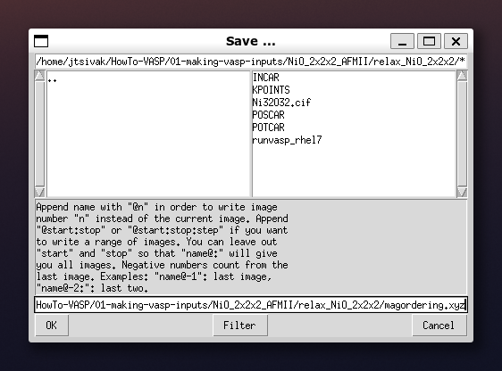

### processing the *.xyz file
Our .xyz file should look like this: 

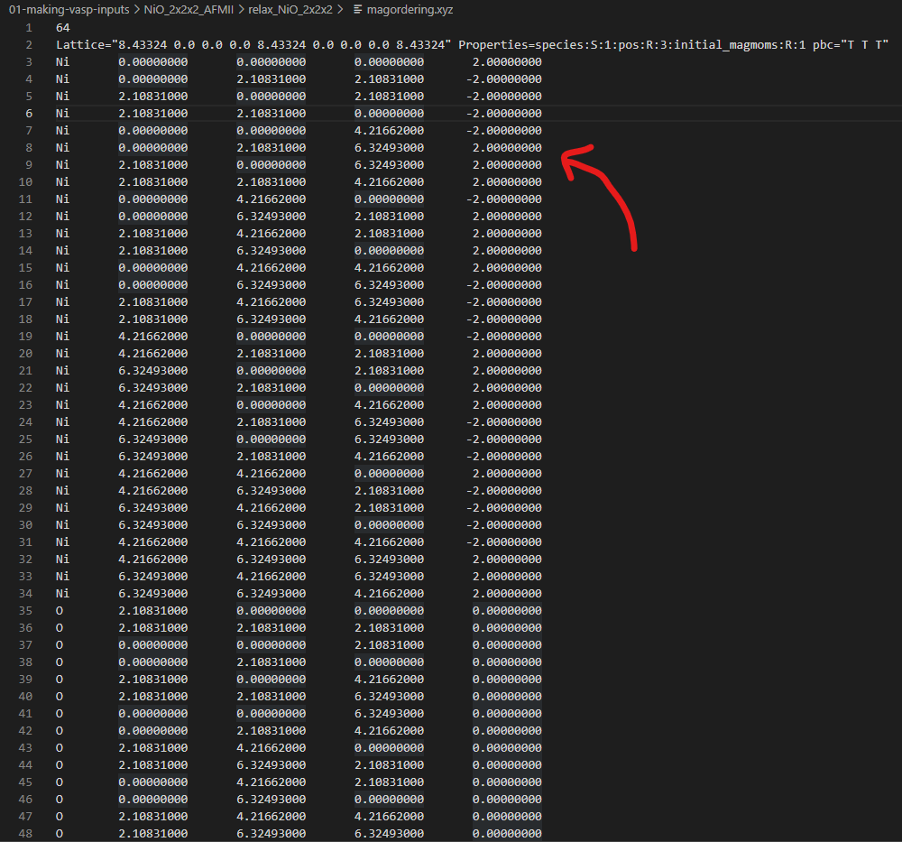
The column corresponding to our magnetic moments is the last column (the one with the red arrow pointing to it).
- First, we need to delete the top two lines of the file using any text editor so that we only have the columns 

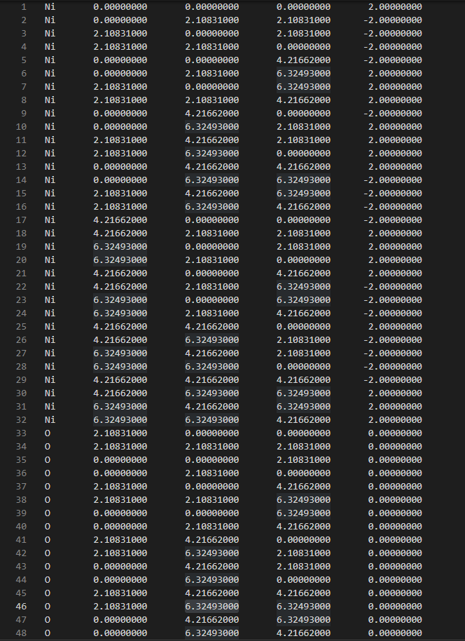

- Next, we need to use a text editor to delete all the columns that we don't want as well as the trailing zeros of the last column 
    - I personally use VS Code, as this as a "Column Selection" mode that I find useful
    - I know there are ways to script this, however I have not gotten around to it just yet
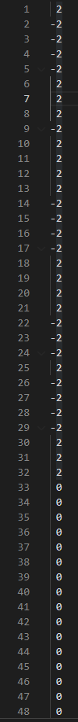

- Save the file (no need to change the name)
- use the following command to change all of the newlines to spaces within our modified *.xyz file:

 $perl -pi -e 's/\n/ /g' *.xyz

- use the following command to change all of the double spaces to single spaces within our modified *.xyz file:

 $perl -pi -e 's/  / /g' *.xyz

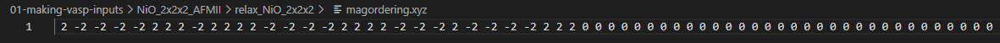

Voila! We now have a format which can be directly copied and pasted to replace the MAGMOM tag within our INCAR file for more complex magnetic systems!

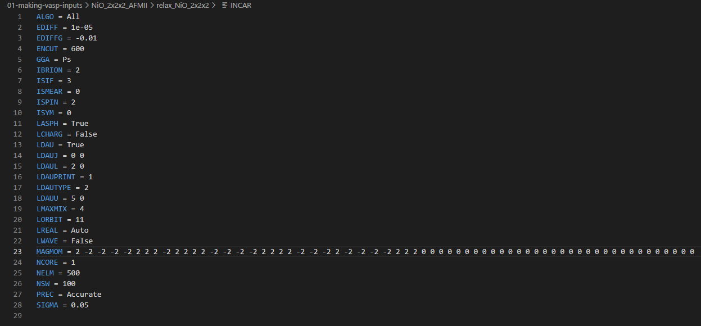

I am currently working on a way to automate this process more, as this is still fairly human-interaction intensive (which basically throws high-throughput calculations out of the window with this current process). This will be updated as I make progress on this.